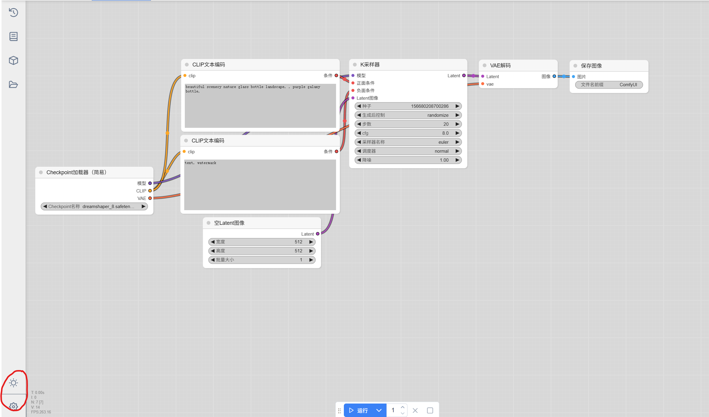
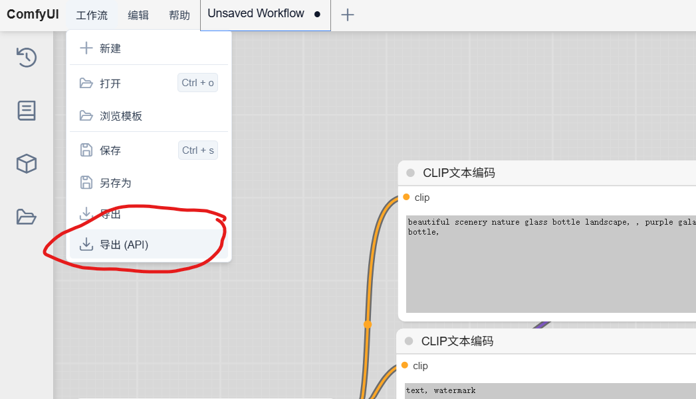

# 本地部署ComfyUI API指南

## 简介：
本项目提供了本地部署ComfyUI，并通过API的方式在python脚本中调用ComfyUI，最终实现自定义调用的指引

### 1. 克隆ComfyUI官方仓库

```cmd
git clone  https://github.com/comfyanonymous/ComfyUI.git
```

### 2. 获取合法的ComfyUI工作流
此处考虑到python脚本只提供了prompt to image的功能，采用课上给出的text2image工作流：`simple-text-2-image-DreamShaper.json`，放在文件夹底下了。

### 3.运行ComfyUI
进入ComfyUI所在文件夹：
```cmd
cd ComfyUI
```
运行`main.py`，根据命令行界面给出的url，打开ComfyUI
```cmd
python main.py
```

### 4.获取工作流的API
将原工作流`simple-text-2-image-DreamShaper.json`拖入ComfyUI界面

点击页面左下角的齿轮图标，在设置中打开开发者模式以运行工作流以API的形式下载

随后在界面的左上角点击保存，并将工作流另存为API，最后保存到当前目录：

当前目录下的工作流API重命名为`workflow_api.json`

### 5.在当前目录运行脚本
于当前文件夹运行python脚本`api.py`:
```cmd
python api.py
```
当前脚本设定为从CLI读取用户输入，并覆写到`workflow_api.json`,最终由ComfyUI读取API工作流，生成图片并保存到指定文件夹。当前脚本的保存文件夹为output，如有需要请修改脚本中的`WORKING_DIR`变量以修改输出文件夹。