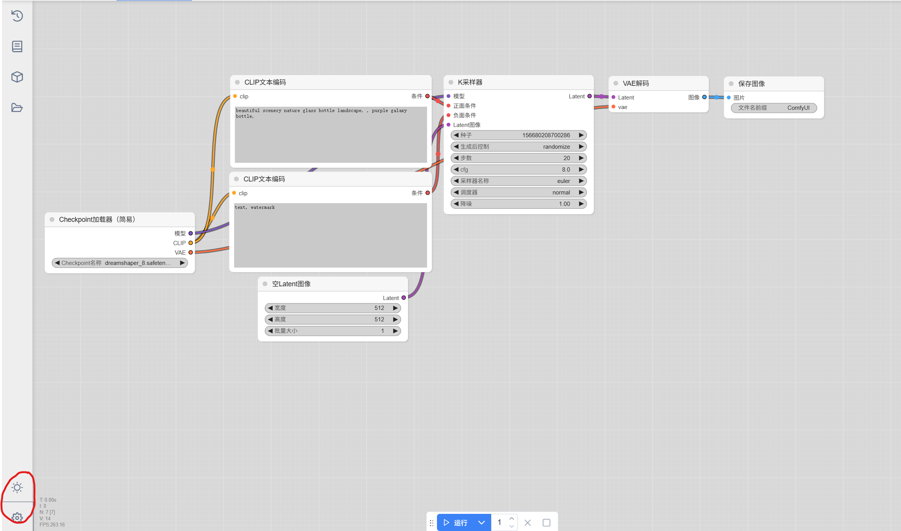
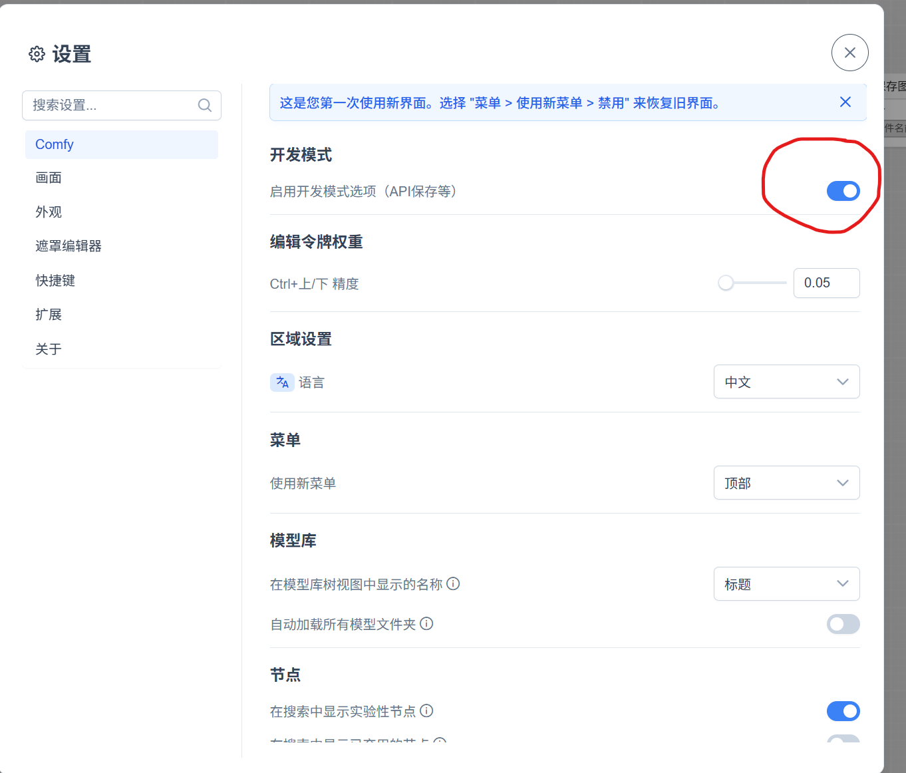
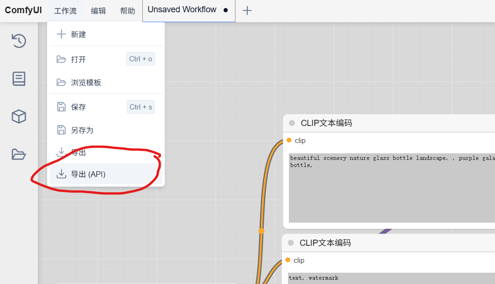

## How to Run

1. 安装 Live Server 插件，右键点击 `frontend/index.html`，选择 `Open with Live Server`，在浏览器中打开网页

2. 在命令行中打开 `backend`，运行 `npm run start`

## 本地部署 ComfyUI API 指南

本项目提供了本地部署 ComfyUI，并通过 API 的方式在 python 脚本中调用 ComfyUI，最终实现自定义调用的指引

### 1. 克隆 ComfyUI 官方仓库

```cmd
git clone https://github.com/comfyanonymous/ComfyUI.git
```

### 2. 获取合法的 ComfyUI 工作流

此处考虑到 python 脚本只提供了 prompt to image 的功能，采用课上给出的 text2image 工作流： `simple-text-2-image-DreamShaper.json`，放在文件夹底下了。

### 3. 运行 ComfyUI

进入 ComfyUI 所在文件夹：

```cmd
cd ComfyUI
```

运行 `main.py`，根据命令行界面给出的 url，打开 ComfyUI

```cmd
python main.py
```

### 4. 获取工作流的 API

将原工作流 `simple-text-2-image-DreamShaper.json` 拖入 ComfyUI 界面


点击页面左下角的齿轮图标，在设置中打开开发者模式以运行工作流以 API 的形式下载


随后在界面的左上角点击保存，并将工作流另存为 API，最后保存到当前目录：


当前目录下的工作流 API 重命名为`workflow_api.json`

### 5. 在当前目录运行脚本

于当前文件夹运行 python 脚本`api.py`:

```cmd
python api.py
```

当前脚本设定为从 CLI 读取用户输入，并覆写到 `workflow_api.json`, 最终由 ComfyUI 读取 API 工作流，生成图片并保存到指定文件夹。当前脚本的保存文件夹为 output，如有需要请修改脚本中的 `WORKING_DIR` 变量以修改输出文件夹。
