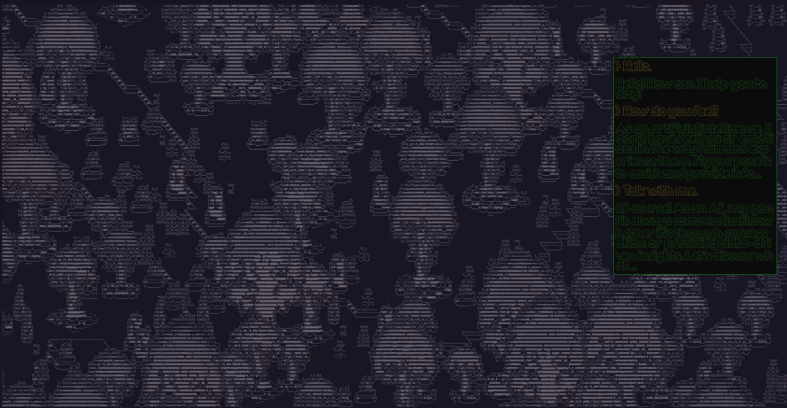
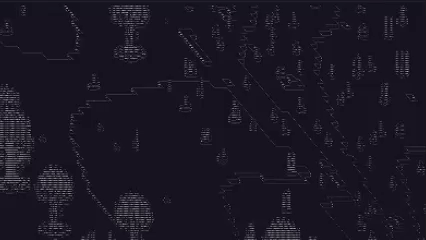
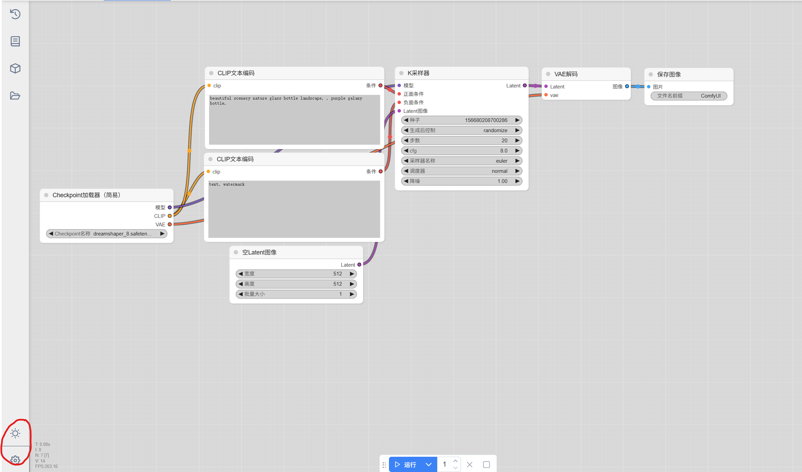
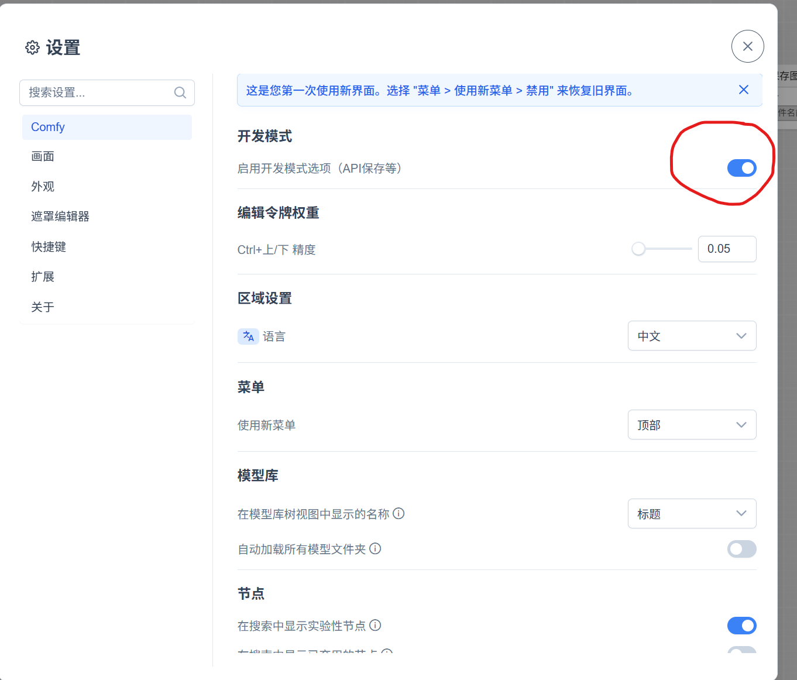
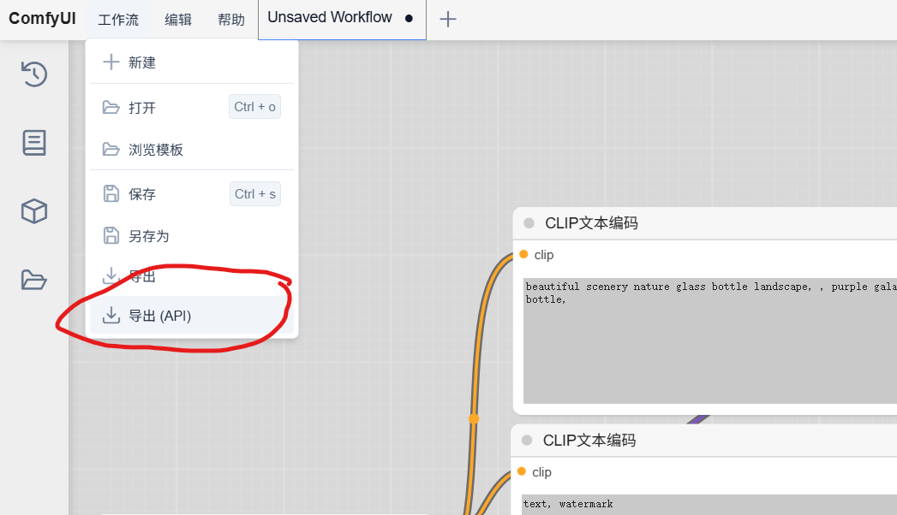

This is a final project for the course *Creative Coding and Interactive Art* at HKUST(GZ) during the Spring semester of 2024-25.

*CodeScape* reveals a 2D ASCII world that scrolls horizontally through diverse biomes—lush forests, mountain peaks, fungal grids, and frozen wastes—each rendered with procedural ASCII characters. An AI guide answers audience questions through a terminal, revealing secrets about the world’s collapse and simulated origins. This is a generative art project that combines the power of AI with the creativity of ASCII art.

## Features

- **Pure ASCII Graphics**: Every element is represented using ASCII characters, creating a unique visual experience.
- **2.5D Isometric View**: Presenting 2.5D isometric effect on 2D canvas, enhancing the depth and immersion of the ASCII world.
- **Dynamic Biomes**: The world is divided into four distinct biomes, each with its own unique ASCII representation.
- **AI Interaction**: An AI guide responds to audience questions, providing insights into the world’s lore and simulated origins.
- **Display Optimization**: Directly display the ASCII world in the terminal, and use [blessed](https://github.com/chjj/blessed) to enable CSR and further reduce refreshing flicker.

## Project Structure

```plaintext
├── backend
│   └── server.js
├── frontend
│   ├── index.html
│   ├── libraries
│   │   ├── p5.min.js
│   │   ├── p5.sound.min.js
│   │   └── p5.speech.js
│   ├── src
│   │   ├── generateSpritePosition.js
│   │   ├── generateTerrain.js
│   │   ├── index.js
│   │   ├── renderScreen.js
│   │   ├── sketch.js
│   │   ├── snowEffect.js
│   │   ├── sprite.js
│   │   ├── sprite_list
│   │   └── util.js
│   └── style.css
├── pregen
│   ├── api.py
│   ├── ComfyUI
│   └── output
├── chat
│   └── LLM_server.py
└── README.md
```

- `backend`: The display server for the project, which handles the messages from the client and displays them in the terminal.
- `frontend`: The central part of the project, written in p5.js, which is responsible for rendering the ASCII world and handling user interactions.
    - 'sketch.js': The main file for the p5.js sketch, and the entry point for the project.
    - 'sprite_list': The folder for the sprite list, which contains the sprite images used in the project.
    - 'sprite.js': Functions for converting the raw images into ASCII art.
- `pregen`: The folder for the ComfyUI API, which is used to generate raw images for sprite generation.
- `chat`: The folder for the AI model, which is used to generate the text responses for the chat mode.

## How to Run

### Basic Setup

1. Environment setup

- Install node.js, python.
- Install js dependencies.
```bash
cd frontend
npm install
cd backend
npm install
```

2. Run the server

- Start the backend server.

```bash
cd backend
npm run start
```

3. Run the client

- Install Live Server extension in VSCode.
- Right click on `frontend/index.html` and select `Open with Live Server` to open the webpage in the browser.
- You should see the display in the server console.

### How to start a talk with AI?

1. Download the Ollama Interface and check its status on the cmd:
```cmd
ollama --version
```

2. Pull a suitable model from the official Ollama repository. We use phi3 model here as a light scale model for chatting:
```cmd
ollama pull phi3
```

3. Run the model to ensure it's properly deployed locally:
```cmd
ollama run phi3
```

4. Change the current working directory into `chat` and run `LLM_server.py` to establish the connection between the model and the server:
```cmd
cd chat
python LLM_server.py
```

5. Now You can chat with the model after granting access of your pc's microphone. Try to say `chat mode` and the chat mode will be activated. Then you can try to chat with the model. To exit chat mode, just say: `exit chat mode`

### Local Deployment Guide for ComfyUI API

This project provides instructions for deploying ComfyUI locally and calling ComfyUI via API in Python scripts, enabling custom usage.

1. Clone the Official ComfyUI Repository

```cmd
git clone https://github.com/comfyanonymous/ComfyUI.git
```

2. Obtain a Valid ComfyUI Workflow

Since the Python script only provides prompt-to-image functionality, use the text2image workflow provided in class: `simple-text-2-image-DreamShaper.json`, which is placed in the folder.

3. Run ComfyUI

Navigate to the ComfyUI folder:

```cmd
cd ComfyUI
```

Run `main.py` and open ComfyUI using the URL provided in the command line interface:

```cmd
python main.py
```

4. Obtain the Workflow API

Drag the original workflow `simple-text-2-image-DreamShaper.json` into the ComfyUI interface.



Click the gear icon in the lower left corner of the page, and enable developer mode in the settings to run the workflow and download it as an API.


Then click save in the upper left corner of the interface, save the workflow as an API, and save it to the current directory:


Rename the workflow API in the current directory to `workflow_api.json`.

5. Run the Script in the Current Directory

Run the Python script `api.py` in the current folder:

```cmd
python api.py
```

The current script is set to read user input from the CLI and overwrite `workflow_api.json`, which is then read by ComfyUI as an API workflow to generate images and save them to the specified folder. The current output folder is `output`. If needed, modify the `WORKING_DIR` variable in the script to change the output folder.

## References

1. Isometric view inspired by ["Stone Story RPG."](https://stonestoryrpg.com/)

2. Image to ASCII art convention method drew from Acerola, ["I tried turning games into text," YouTube.](https://www.youtube.com/watch?v=gg40RWiaHRY)

3. Terminal interface API for node.js blessed: ["chjj/blessed: A high-level terminal interface library for node.js.," GitHub.](https://github.com/chjj/blessed)

4. ASCII art font convention tool FIGlet: ["cmatsuoka/figlet: Claudio’s FIGlet tree," GitHub.](https://github.com/cmatsuoka/figlet)

5. Raw image generation utilizing ComfyUI: ["comfyanonymous/ComfyUI: The most powerful and modular diffusion model GUI, api and backend with a graph/nodes interface.," GitHub.](https://github.com/comfyanonymous/ComfyUI)